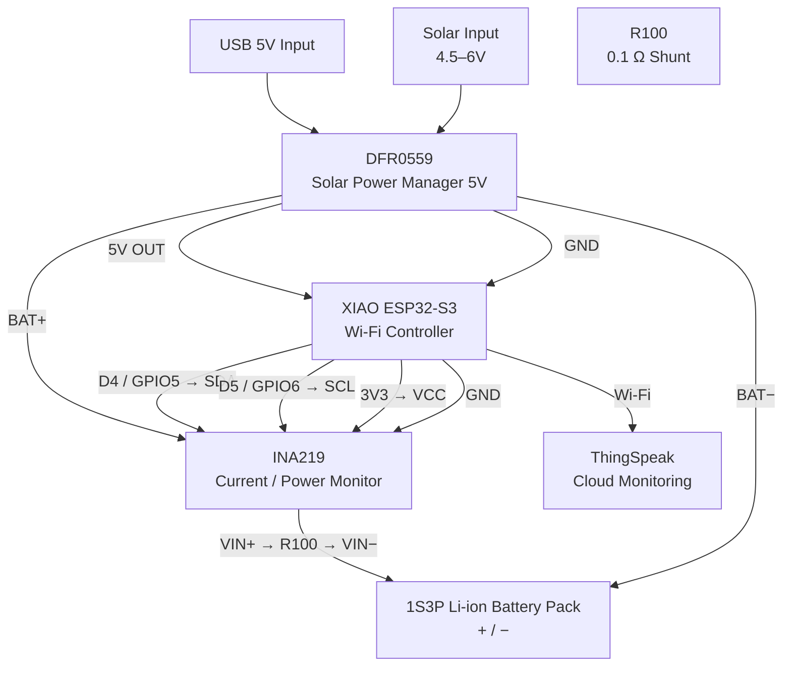

# Wiring

D4/GPIO5 -> SDA; D5/GPIO6 -> SCL; 3V3 -> VCC; GND -> GND.

INA219 address: 0x40.

```mermaid
flowchart TB

    USB["USB 5V Input"]
    SOLAR["Solar Input<br/>4.5–6V"]

    DFR["DFR0559<br/>Solar Power Manager 5V"]

    BAT["1S3P Li-ion Battery Pack<br/>+ / −"]

    INA["INA219<br/>Current / Power Monitor"]
    SHUNT["R100<br/>0.1 Ω Shunt"]

    XIAO["XIAO ESP32-S3<br/>Wi-Fi Controller"]
    TS["ThingSpeak<br/>Cloud Monitoring"]

    USB --> DFR
    SOLAR --> DFR

    DFR -- "BAT+" --> INA
    INA -- "VIN+ → R100 → VIN−" --> BAT

    DFR -- "BAT−" --> BAT

    DFR -- "5V OUT" --> XIAO
    DFR -- "GND" --> XIAO

    XIAO -- "D4 / GPIO5 → SDA" --> INA
    XIAO -- "D5 / GPIO6 → SCL" --> INA
    XIAO -- "3V3 → VCC" --> INA
    XIAO -- "GND" --> INA

    XIAO -- "Wi-Fi" --> TS
```
